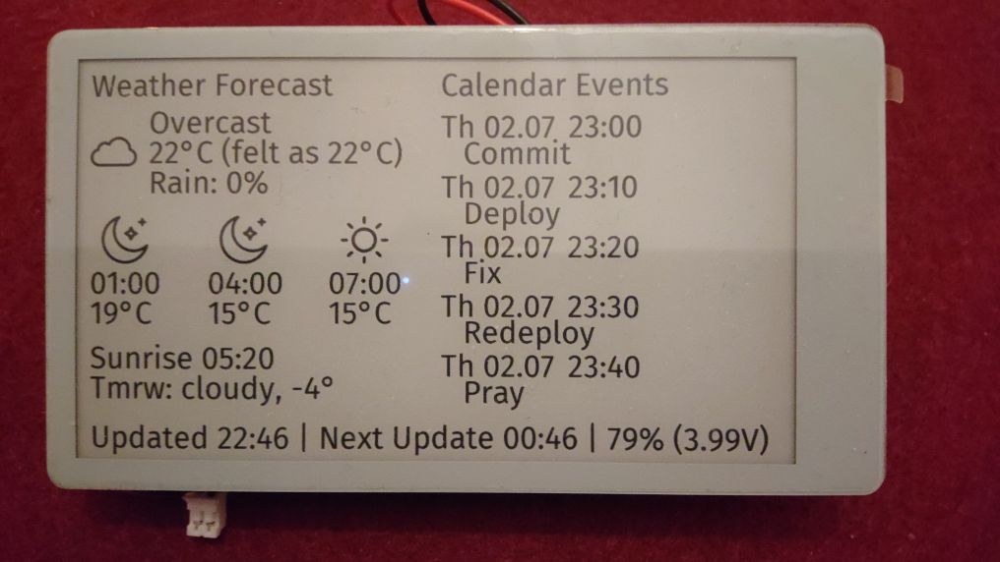

# LilyGo ePaper Dashboard 

An info screen for the LilyGo T5 EPD47-S3 e-paper board. Shows a weather
forecast on the left half of the screen and, depending on time of day, either
public-transit commute options or upcoming calendar events on the right half.
A footer line reports last-update time, next refresh, and battery level.



## 🔌 Hardware

- LilyGo T5 4.7" e-paper (S3 variant)
- Powered via exteral LiPo or USB (lasts multiple months on standard 18650 battery with 3500mAh)

## 📊 What it shows

- **Weather** - multi-step forecast via [Open-Meteo](https://open-meteo.com/) with icon, temperature and condition.
- **Commute (morning)** - via [Transitous API](https://transitous.org/api/) including delays and transfers.
- **Calendar (rest of day)** - upcoming events parsed from a Google Calendar private ICS link.
- **Bike vs. train recommendation** - derived from the weather forecast over the commute window.

The right-half panel switches between commute and calendar based on the local hour (`COMMUTE_HOURS_START` / `COMMUTE_HOURS_END`).
Outside the commute window the device also refreshes less frequently to save battery.

## 🚀 Setup

1. Install [PlatformIO](https://platformio.org/) (CLI or VS Code extension).
2. Copy `src/config.example.h` to `src/config.h` and fill in:
   - WiFi credentials
   - Location latitude/lonitude
   - Station IDs for your commute
   - Google Calendar private ICS URL
     (Calendar settings → Secret address in iCal format)
3. Build & flash

### Flashing from WSL

The upload step auto-attaches the board to WSL via [usbipd-win](https://github.com/dorssel/usbipd-win).
This requires a one-time setup per machine in an **admin** PowerShell:

```
usbipd bind --busid 2-1
```

After binding, clicking Upload (or `pio run -t upload`) attaches the device automatically.
If your board enumerates on a different bus, update `USBIPD_BUSID` in `scripts/attach_usb.py`.

### Development

- During development, set `ARDUINO_USB_CDC_ON_BOOT=1` in `platformio.ini` to get a serial console.
  Set back to `0` to enable battery use.
- A short hold-off on cold boot leaves a window for re-flashing before the device enters its deep-sleep cycle.

## 🙏 Credits

- Weather icons from the [Basic Rounded Lineal](https://www.flaticon.com/search?author_id=1&style_id=4&type=standard&word=weather)
  set by [Freepik](https://www.flaticon.com/authors/freepik) on Flaticon.
- [Open-Meteo](https://open-meteo.com/) for weather data.
- [Transitous](https://transitous.org/api/) for public transport data.